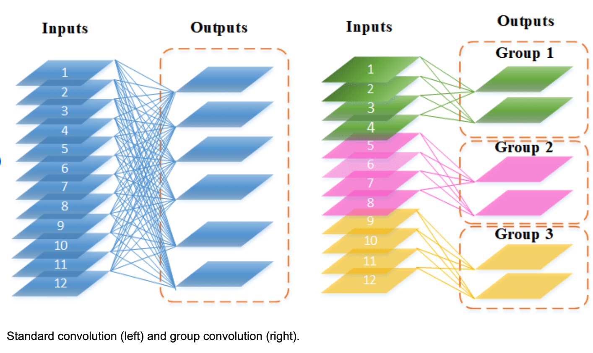

MnasNet
####################

:Author: Mingxing Tan
:Team: Google Research, Brain Team
:Date: 2019
:NoteBy: Xuemei, 2022

we propose an automated mobile neural architecture search (MnasNet) approach. (自动，手机上应用，网络架构搜素方法)

To further strike the right balance between flexibility and search space size,
we propose a novel factorized hierarchical search space that encourages layer diversity throughout the network
(灵活性和搜索范围之间的平衡？如何确保网络层级的多样性，怎么保证你搜索到了呢？)

Experimental results show that our approach consistently outperforms state-of-the-art mobile CNN models across multiple vision tasks.
(多任务上都有上佳表现)

On the ImageNet classification task, our MnasNet achieves 75.2% top-1 accuracy with 78 ms latency on a Pixel phone,
which is :math:`1.8\times` faster than MobileNetV2 with 0.5% higher accuracy and
:math:`2.3\times` faster than NASNet with 1.2% higher accuracy. (三个网络在同一任务上，针对准确率和速度的比较)

Our MnasNet also achieves better mAP quality than MobileNets for COCO object detection. (更综合的指标 mAP)

https://github.com/tensorflow/tpu/tree/master/models/official/mnasnet

To summarize, our main contributions are as follows:

1. We introduce a *multi-objective* neural architecture search approach that optimizes both accuracy and real-world latency on mobile devices.
2. We propose a novel *factorized hierarchical search space* to enable layer diversity
   yet still strike the right balance between filexibility and search space size.
3. We demonstrate new state-of-art accuracy on both ImageNet classification and COCO object detection
   under typical mobile latency constraints.

Related Work
====================

Some commonly-used approaches to improve the resource efficiency of CNN models includes: (有模型的情况下)

1. quantizing the weights and/or activations of a baseline CNN model into lower-bit representations.
2. pruning less important filters according to FLOPS,
   or to platform-aware metrics such as latency.
However, these methods are tied to a baseline model and do not focus on learning novel compositions of CNN operations. 

Another common approach is to directly hand-craft more efficient mobile architectures (直接从模型出发), for example:

1. SqueezeNet: reduces the number of parameters and computation by **using lower-cost 1x1 convolutions** and reducing filter sizes;
2. MobileNet: extensively employs **depthwise separable convolution** to minimize computation density;
3. SuffleNets: utilize **low-cost group convolution** and **channel shuffle**;
4. CondenseNet: learns to **connect group convolutions across layers**;
5. MobileNetV2: uses **resource-efficient inverted residuals** and **linear bottlenecks**.

Unfortunately, given the potentially huge design space, these hand-crafted models usually take significant human efforts.

Recently, there has been growing interest in automating the model design process using neural architecture search:
These approaches are mainly based on: (架构搜索)

1. reinforcement learning
2. evolutionary search
3. differentiable search
4. ohters

Although these methods can generate mobile-size models by repeatedly stacking a few searched cells,
they do not incorporate mobile platform constraints into the search process or search space.

Closely related to our work is: (优化任务)

1. MONAS
2. DPP-Net
3. RNAS
4. Pareto-NASH

They attempt to optimize multiple objectives, such as model size and accuracy, while searching for CNNs,
but their search process optimizes on small tasks like CIIFAR.

In contrast, this paper targets real-world mobile latency constraints and focuses on larger tasks
like ImageNet classification and COCO object detection.

Problem Formulation
========================

We formulate the design problem as a multi-objective search, aiming at finding CNN models with both high-accuracy and low inference latency.

Given a model :math:`m`, let :math:`ACC(m)` denote its accuracy on the target task,
:math:`LAT(m)` denotes the inference latency on the target mobile platform,
and :math:`T` is the target latency.

A common method is to treat :math:`T` as a hard constrint and maximize accuracy under this constraint:

.. math::

        &\max_{m} ACC(m) \\
        &\text{subject to }LAT(m) \le T

However, this approach only maximizes a single metric and does not provide multiple Pareto optimal solutions.

Informally, a model is called Pareto optimal if
either it has the highest accuracy without increasing latency or
it has the lowest latency without decreasing accuracy.

A point :math:`x^{\star}` in the feasible design space :math:`S` is Pareto optimal if and only if
there does not exist another point :math:`x` in the set :math:`S` such that :math:`f(x) \le f(x^{\star})` with at least one
:math:`f_i(x) > fi(x^{\star})`.

We use a customized weighted product method to approximate Pareto optimal solutions,
with optimization goal defined as:

.. math::

        \max_m ACC(m) \times[\frac{LAT(m)}{T}]^\omega

where :math:`\omega` is the weight factor defined as:

.. math::

        m = \begin{cases}
            \alpha,  & if \quad LAT(m) \le T\\
            \beta,  & otherwise
            \end{cases}

where :math:`\alpha` and :math:`\beta` are application-specific constants.
An empirical rule for picking :math:`\alpha` and :math:`\beta` is to ensure
Pareto-optimal solutions have similar reward under different accuracy-latency trade-offs.
For instance, we empirically observed doubling the latency usually brings about 5% relative accuracy gain.
Given two models:

        * M1 has latency :math:`l` and accuracy :math:`a`;
        * M2 has latency :math:`2l` and 5% highere accuracy :math:`a\cdot ( 1 + 5\% )`,

They should have similar reward:
:math:`Reward(M2) = a\cdot( 1 + 5\% ) \cdot(2l/T)^{\beta}` 

Mobile Neural Architecture Search
====================================

Factorized Hierarchical Search Space
---------------------------------------

Previous approaches don't permit layer diversity, which we show is critical for achieving both high accuracy and lower latency.

We introduce a novel factorized hierarchical search space that factorizes a CNN model into unique blocks and
then searches for the operations and connections per block separately,
thus allowing different layer architectures in different blocks.

Our intuition is that we need to search for the best operations based on the input and output shapes
to obtain better accurate-latency trade-offs.

For example, earlier stages of CNNs usually process larger amounts of data and thus
have much higher impact on inference latency than later stages.

Search Algorithm
---------------------------------------

We use a reinforcement learning approach to find Pareto optimal solutions for our multi-objective search problem.
We choose reinforcement learning because it is convenient and the reward is easy to customize,
but we expect other methods like evolution should also work.

Appendix
========================

Depthwise separable convolutions
---------------------------------------

regular convolution

depthwise separable convolutions

group convolutions
---------------------------------------

matrix vs. diagonal matrix

ResNet (2015 Microsoft)
---------------------------------------
https://towardsdatascience.com/an-overview-of-resnet-and-its-variants-5281e2f56035
https://blog.paperspace.com/popular-deep-learning-architectures-resnet-inceptionv3-squeezenet/

Aa deep neural networks are both time-consuming to train and prone to overfitting,
a team at Microsoft introduced a residual learning framework to improve the training of networks
taht are substantially deeper than those used previously.

When training deep networks there comes a point
where an increase in depth couses accuracy to staturate,
then degrade rapidly. This is called the "degradation problem".
This highlights that all neural network architectures are equally easy to optimize.

ResNet uses a technique called "residual mapping" to combat this issue.
Instead of hoping that every few statcked layers directly fit a desired underlying mapping,
the Residual Network explicitly lets these layers fit a residual mapping.

.. image:: resnet0.png

Many problems can be addressed using ResNets.
They are easy to optimize and achieve higher accuracy when the depth of the network increases,
producing results that are better than previous networks.
ResNet was first trained and tested on ImageNet's over 1.2 million training images belonging to 1000 different classes.

.. image:: resnets.png

Increasing network depth does not work by simply stacking layers together.
Deep networks are hard to train because of the notorious vanishing gradient problem ---
as the gradient is back-propagated to earlier layers,
repeated multiplication may make the gradient infinitively small.
As a result, as the network goes deeper, its performance gets saturated or even starts degrading rapidly.

The core idea of ResNet is introducing a so-called "identity shortcut connection"
that skips one or more layers, as shown in the following figure:

As a matter of fact, ResNet was not the first to make use of shortcut connections,
Highway Network introduced gated shortcut connections.
These parameterized gates control how much information is allowed to flow across the shortcut.
Similar idea can be found in the Long Term Short Memory (LSTM) cell,
in which there is a parameterized forget gate that controls how much information will flow to the next time step.
Therefore, ResNet can be thought of as a special case of Highway Network.

However, experiments show that Highway Network performs no better than ResNet,
which is kind of strange because the solution space of Highway Network contains ResNet,
therefore it should perform at least as good as ResNet.
This suggests that it is more important to keep these "gradient highways" clear than
to got far larger solution space.

Wide ResNet (2016)
---------------------------------------

The Wide Residual Network is a more recent improvement on the original Deep Residual Networks.
Rather than relying on increasin the depth of a network to improve its accuracy,
it was shown that a network could be made shallower and wider without compromising its performance.
This ideology was presented in the paper Wide Residual Networks, which was puslished in 2016
(and updated in 2017 by Sergey Zagoruyko and Nikos Komodakis).

ResNeXt
---------------------------------------

Xie et al. proposed a variant of ResNet that is codenamed ResNeXt with the following build block:

.. image:: resnext.png

This may look familiar to you as it is very similar to the Inception module,
they both follow the split-transform-merge paradigm, expect in this variant,
the outputs of different paths are merged by adding them together,
each path is different (:math:`1\times 1`, :math:`3\times 3`, and :math:`5\times 5` convolution) from each other,
while in this architecture, all paths share the same topology.

The authors introduced a hyper-parameter called cardinality -- 
the number of independent path, to provide a new way of adjusting the model capacity.
Experiments show that accuracy can be gained more efficiently by increasing the cardinality than
by going deeper of wider.

https://towardsdatascience.com/an-overview-of-resnet-and-its-variants-5281e2f56035

DenseNet
---------------------------------------

Huang et al. proposed a novel architecture called DenseNet that further exploits
the effects of shortcut connections -- it connects all layers directly with each other.
In this novel architecture, the input of each layer consists of the feature maps of all earlier layer,
and its output is passed to each subsequent layer.
The feature maps are aggregated with depth-concatenation.

.. image:: densenet.png

Other than tackling the vanishing gradients problem,
the authors argue that this architecture also encourages feature reuse,
making the network highly parameter-efficient.
One simple interpretation of this is that,
the output of the identity mapping was added to the next block,
which might impede information flow if the feature masps of two layers have very different distributions.
Therefore, concatenating feature maps can preserve them all and
increase the variance of the outputs, encouraging feature reuse.

Following this paradigm, we know that the *l_th* layer will have :math:`k \cdot (l - 1) + k_0` input featurea maps,
where :math:`k_0` is the number of channels in the input image.
The authors used a hyper-parameter called grownth rate (k) to prevent the network from growing too wide,
they also used a :math:`1\times 1` convolutional bottleneck layer to reduce the number of feature maps
before the expensive :math:`3\times 3` convolution.
The overall architecture is shown in the below table:

.. image:: densenettable.png

Although ResNet has proven powerful in many applications,
one major drawback is that deeper network usually requires weeks for training,
making it practically infeasible in real-world applications.
To tackle this issue, Huang et al. introduced a counter-intuitive method of randomly dropping layers during training,
and using the full network in tesing 

Inception Module in GoogLeNet
---------------------------------

https://valentinaalto.medium.com/understanding-the-inception-module-in-googlenet-2e1b7c406106

GoogLeNet is a 22-layer deep convolutional network
whose architecture has been presented in the ImageNet Large-Scale Visual Recognition Challenge in 2014.

The main novelty in the architecture of GoogLeNet is the introduction of a particular module called Inception.

Common Trade-Off in CNN

The main idea of the Inception module is that of runnint multiple operations (pooling, convolution)
with multiple filter sizes (:math:`3 \times 3`, :math:`5\times 5` ...)
in parallel so that we do not have to face any trade-off.

Inception v3
---------------------------------------

Inverted residual block
---------------------------------------

A traditional Residual Block has a wide -> narrow -> wide structure with the number of channels. 
The input has a high number of channels, which are compressed with a :math:`1\times1` convolution.
The number of channels is then increased again with a :math:`1\times1` convolution so input and output can be added.

In contrast, and Inverted Residual Block follows a narrow -> wide -> narrow approach,
hence the inversion. We first widen with a 1x1 convolution,
then use a 3x3 depthwise convolution (which greatly reduces the number of parameters),
then we use a 1x1 convolution to reduce the number of channels so input and output can be added.

1. 对问题的表述
2. 系统性地展开问题的重要性
3. 

mAP

SqueezeNet (2016 DeepScale, California, Berkeley, Stanford)
---------------------------------------------------------------

SqueezeNet is a smaller network that was designed as a more compact replacement for AlexNet.
It has almost :math:`50\times` fewer parameters than AlenNex, yet it preforms :math:`3\times` faster.
This architecture was proposed by researchers at DeepScale, The University of California, Berkeley,
and Stanford University in the 2016.

`SqueezeNet: AlexNet-level accuracy with 50x fewer parameters and <0.5MB model size <https://arxiv.org/abs/1602.07360>`_

Below are the key ideas behind SqueezeNet:

    * Strategy One: use :math:`1\times 1` filters instead of :math:`3\times 3` (不考虑和邻居的关系, 参数减少 9 倍)
    * Strategy Two: decrease the number of input channels to :math:`3 \times 3` (减少:math:`3\times3` 的通道数, 减少有邻居有关的特征)
    * Strategy Three: Downsample late in the network so that convolution layers have large activation maps. (增加网络的计算量)

**Summary**

    * Strategies 1 and 2 are about judiciously decreasing the quality of parameters in a CNN
      while attempting to preserve accuracy.
    * Strategy 3 is about maximizing accuracy on a limited budget of parameters.

**Goal of development**

The idea behind designing SqueezeNet, was to create a smaller neural network with fewer parameters
(hence lesser computations and lesser memory requirements and low inference time)
that can easily fit into memory devices and can more easily be transmitted over a computer network.

  

Summarizing AlexNet model:
Model Size: 240mb without compression methods.
Accuracy: 80.3% Top-5 ImageNet, 57.2% Top-1 ImageNet

The Fire module comprises:

A **squeeze convolution layer** (which has only :math:`1\times 1` filters),
feeding into an **expand layer** that has a mix of :math:`1 times 1` and :math:`3\times 3` convolution filters.

squeeze or expand refer to number of channel.

Compression techniques
-----------------------------

    * Pruning
    * Quantization
    * Low-rank approximation and sparsity
    * Knowledge distillation
    * Neural Architecture Search (NAS)

`An Overview of Model Compression Techniques for Deep Learning in Space <https://medium.com/gsi-technology/an-overview-of-model-compression-techniques-for-deep-learning-in-space-3fd8d4ce84e5>_`

Pruning
...................

Pruning involves removing connections between neurons or entire neurons, channels, or filters from a trained network,
which is done by zeroing out values in its weights matrix or removing groups of weights entirely.

This not only helps reduce the overall model size but also saves on computation time and energy.

Quantization
...................

Quantization is the process of reducing the size of the weights that are there in the network.

Huffman coding
...................

It is a lossless data compression algorithm.
The idea is to assign variable-length codes to input characters,
lengths of the assigned codes are based on the freqquencies of corresponding characters.
The mose frequent character gets the smallest code and the least frequent character gets the largest code.
